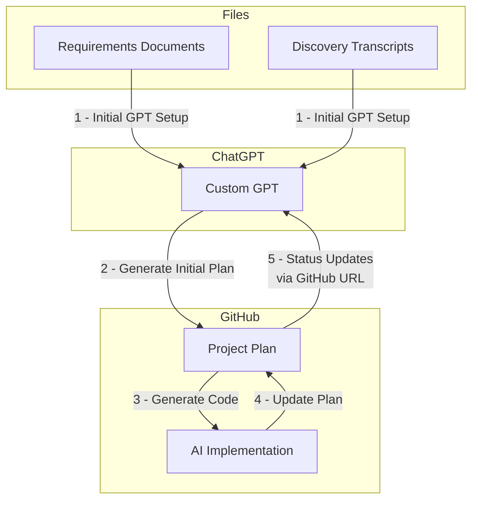

# TruckScout - Streamline Your Trucking Brokerage Operations

TruckScout is a modern SaaS platform designed to simplify and streamline trucking brokerage operations. Built for brokers and factoring companies, it provides a comprehensive solution for managing contacts, billing, and reporting in the trucking industry.

## Project Overview

This project follows the [Doc Driven Development (DocDD)](https://docdrivendev.com/) methodology developed by [Ryan Vice](https://www.linkedin.com/in/ryanvice/), emphasizing comprehensive documentation and AI-powered development tools to allow increasing velocity by X factors with high quality code and alignment with business goals.

### Key Features

- **Authentication & User Management**: Secure multi-factor authentication with role-based access control
- **Billing Management**: Comprehensive invoicing system for accounts receivable and payable
- **Contact Management**: Efficient handling of carrier and factoring company relationships
- **Reporting**: Executive summaries and detailed operational insights
- **Multi-tenant Architecture**: Support for both individual brokers and organizations

### Development Approach



We are using a heavily AI driven approach that utilizes a combination of:
- [Flow diagrams/ERD documents and call transcripts](docs/requirements/rag) for system design
- [AI Agent Product Owner](https://chatgpt.com/g/g-67545b7de2088191b29e78715371ac98-truck-scout-product-owner) (PO) 
  - Custom GPT with Retrieval-Augmented Generation (RAG) for requirements management

> 📚 **[Learn more about our Doc Driven Development Process](docs/doc-driven-development.md)** - Discover how we're revolutionizing development with AI-powered documentation

## Technical Foundation

This project is built on the MakerKit Supabase SaaS Starter Kit (Turbo Edition), leveraging:
- Next.js for the frontend framework
- Supabase for backend services
- Tailwind CSS for styling
- Turborepo for monorepo management

## Documentation

- [Project Plan & Requirements](/docs/requirements/initial_project_plan.md)
- [Technical Documentation](https://makerkit.dev/docs/next-supabase-turbo/introduction)
- [Flow Diagrams & ERDs](/docs/requirements/rag/)
- [Testing Best Practices](/docs/testing-best-practices.md)

### Documentation Scrapers

We maintain local copies of external documentation using scrapers to ensure offline access and integration with our development workflow. The scrapers are located in `docs/scrapers/`:

```bash
# Run the MakerKit documentation scraper
node docs/scrapers/makerkit-scraper.js
```

Scraped documentation is saved to the `docs/scraped` directory:
- MakerKit documentation: `docs/scraped/makerkit/`

## Getting Started

1. Clone the repository
2. Follow the [MakerKit setup documentation](https://makerkit.dev/docs/next-supabase-turbo/introduction)
3. Review the [project plan](/docs/requirements/initial_project_plan.md) for development context

### Running Supabase Locally

To work with the local Supabase instance:

1. Start the Supabase services:
```bash
pnpm run supabase:web:start
```

2. Reset the database (if needed):
```bash
pnpm run supabase:web:reset
```

3. Access Supabase Studio:
   - Open http://127.0.0.1:54323 in your browser
   - Login credentials:
     - Email: admin@admin.com
     - Password: admin
   - Use the left sidebar to navigate:
     - Table Editor: View and modify database tables
     - SQL Editor: Run custom queries
     - Authentication: Manage users and settings
     - Storage: Manage file storage

4. Direct Database Connection (for external tools):
   - Host: 127.0.0.1
   - Port: 54322
   - Database: postgres
   - Username: postgres
   - Password: postgres

### Running Tests

> For detailed testing guidelines, see our [Testing Best Practices](/docs/testing-best-practices.md). Here's the basic workflow for running tests:

1. Start Supabase:
```bash
pnpm run supabase:web:start
```

2. Reset the database (optional, but recommended before running tests):
```bash
pnpm run supabase:web:reset
```

3. Run all tests:
```bash
pnpm run test
```

4. Run tests for a specific workspace (optional):
```bash
pnpm --filter web-e2e test
```

5. Run a specific test file (optional):
```bash
# Run a specific E2E test file from the project root
pnpm --filter web-e2e test tests/carriers/carrier.spec.ts
```

Note: 
- The `web-e2e` is the package name for our end-to-end (E2E) test workspace, located in the `apps/e2e/` directory. 
- Always ensure Supabase is running and the database is in a known state before running tests.
- Use `pnpm run supabase:web:reset` to reset the database to a clean state, which can help prevent test interference.

## Contributing

This project is under active development. Contributors should:
1. Review the project plan and documentation
2. Follow the doc-driven development methodology
3. Ensure all changes are properly documented
4. Submit PRs with corresponding documentation updates

## Status & Progress

Track our development progress in:
- GitHub Issues for specific tasks
- Project Plan for overall progress
- Regular documentation updates

---

Built with [MakerKit](https://makerkit.dev/)
