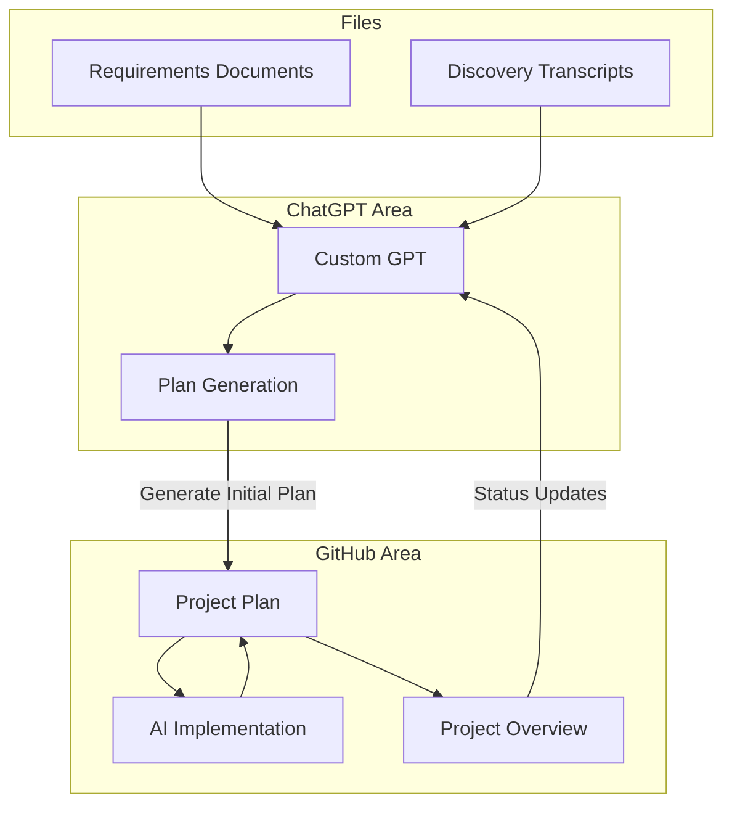

# TruckScout - Streamline Your Trucking Brokerage Operations

TruckScout is a modern SaaS platform designed to simplify and streamline trucking brokerage operations. Built for brokers and factoring companies, it provides a comprehensive solution for managing contacts, billing, and reporting in the trucking industry.

## Project Overview

This project follows the [Doc Driven Development (DocDD)](https://docdrivendev.com/) methodology developed by [Ryan Vice](https://www.linkedin.com/in/ryanvice/), emphasizing comprehensive documentation and AI-powered development tools to allow increasing velocity by X factors with high quality code and alignment with business goals.

### Key Features

- **Authentication & User Management**: Secure multi-factor authentication with role-based access control
- **Billing Management**: Comprehensive invoicing system for accounts receivable and payable
- **Contact Management**: Efficient handling of carrier and factoring company relationships
- **Reporting**: Executive summaries and detailed operational insights
- **Multi-tenant Architecture**: Support for both individual brokers and organizations

### Development Approach

We are using a heavily AI driven approach that utilizes a combination of:
- [Flow diagrams/ERD documents](docs/requirements/rag) and call transcripts for system design
- [AI Agent Product Owner](https://chatgpt.com/g/g-67545b7de2088191b29e78715371ac98-truck-scout-product-owner) (PO) 
  - Custom GPT with Retrieval-Augmented Generation (RAG) for requirements management
- [Detailed Doc Driven Development Process](docs/doc-driven-development.md) - Learn more about our development methodology

## Technical Foundation

This project is built on the MakerKit Supabase SaaS Starter Kit (Turbo Edition), leveraging:
- Next.js for the frontend framework
- Supabase for backend services
- Tailwind CSS for styling
- Turborepo for monorepo management

## Documentation

- [Project Plan & Requirements](/docs/requirements/initial_project_plan.md)
- [Technical Documentation](https://makerkit.dev/docs/next-supabase-turbo/introduction)
- [Flow Diagrams & ERDs](/docs/requirements/rag/)

## Getting Started

1. Clone the repository
2. Follow the [MakerKit setup documentation](https://makerkit.dev/docs/next-supabase-turbo/introduction)
3. Review the [project plan](/docs/requirements/initial_project_plan.md) for development context

## Contributing

This project is under active development. Contributors should:
1. Review the project plan and documentation
2. Follow the doc-driven development methodology
3. Ensure all changes are properly documented
4. Submit PRs with corresponding documentation updates

## Status & Progress

Track our development progress in:
- GitHub Issues for specific tasks
- Project Plan for overall progress
- Regular documentation updates

---

Built with [MakerKit](https://makerkit.dev/)
