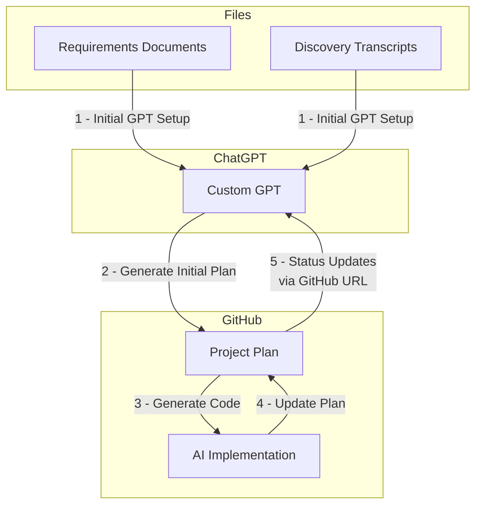

# Doc Driven Development

## Overview
Doc Driven Development is a methodology developed by [Ryan Vice](https://docdrivendev.com/) that emphasizes using comprehensive documentation and AI tools to streamline development and maintain alignment throughout the project lifecycle.

## Process Flow

## Detailed Process

1. **Initial GPT Setup**
   - Load Requirements Documents and Discovery Transcripts into Custom GPT
   - Documents include flow diagrams, ERDs, and meeting transcripts
   - Creates a comprehensive knowledge base for project understanding

2. **Generate Initial Plan**
   - Custom GPT analyzes loaded documents
   - Generates executable markdown Project Plan
   - Establishes foundation for implementation and tracking

3. **Generate Code**
   - AI Agents use Project Plan to implement features
   - Follow specifications and requirements from plan
   - Create working code based on documented requirements

4. **Update Plan**
   - Implementation progress feeds back to Project Plan
   - Document changes and completed features
   - Keep plan in sync with actual development

5. **Status Updates via GitHub URL**
   - Project Plan in GitHub provides latest status
   - Custom GPT accesses updated plan through GitHub URL
   - Enables informed decisions for future planning and requirements

## Key Benefits

- **Alignment**: Documentation drives development, ensuring all stakeholders work from the same understanding
- **Efficiency**: AI tools streamline the process from requirements to implementation
- **Adaptability**: Continuous feedback loop allows for rapid iteration and improvement
- **Transparency**: Public documentation and clear process flow keeps everyone informed
- **Consistency**: AI ensures documentation and implementation remain in sync

## Project Implementation

For this project's specific implementation and current status, see:
- [Project Plan](./requirements/initial_project_plan.md) - Detailed plan and progress tracking
- [README.md](../README.md) - Project overview and quick start

## For GPTs

This documentation serves as a reference for the Doc Driven Development process. When generating plans or making implementation decisions:
1. Follow the process flow outlined in the diagram
2. Reference the project plan for current status and requirements
3. Maintain documentation alignment across all files
4. Ensure changes are reflected in both implementation and documentation
