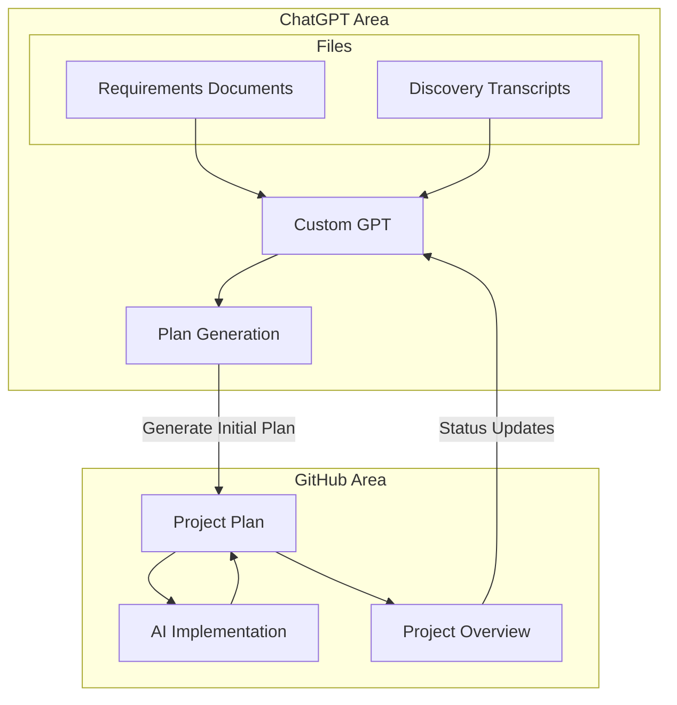

# Doc Driven Development

## Overview
Doc Driven Development is a methodology developed by [Ryan Vice](https://docdrivendev.com/) that emphasizes using comprehensive documentation and AI tools to streamline development and maintain alignment throughout the project lifecycle.

## Process Flow

## Detailed Process

1. **Initial GPT Setup**
   - Create a custom GPT loaded with comprehensive requirements documentation
   - Include flow diagrams containing ERDs and discovery/review meeting transcripts
   - GPT serves as a knowledge base for project requirements and decisions

2. **Plan Generation**
   - Utilize the custom GPT to generate an executable markdown plan
   - Plan serves as a living document that guides implementation
   - Ensures alignment between requirements and execution

3. **AI-Driven Implementation**
   - AI Agents execute items from the plan
   - Maintain and update plan documentation as implementation progresses
   - Ensures documentation stays in sync with development

4. **Documentation Integration**
   - Project overview document links back to plan in GitHub
   - Public repository maintains transparency and accessibility
   - Enables seamless information flow between documentation and implementation

5. **Continuous Evolution**
   - Custom GPT maintains access to latest plan status via GitHub
   - Enables informed decisions for future requirements and planning
   - Creates a feedback loop between implementation and planning

## Key Benefits

- **Alignment**: Documentation drives development, ensuring all stakeholders work from the same understanding
- **Efficiency**: AI tools streamline the process from requirements to implementation
- **Adaptability**: Continuous feedback loop allows for rapid iteration and improvement
- **Transparency**: Public documentation and clear process flow keeps everyone informed
- **Consistency**: AI ensures documentation and implementation remain in sync

## Project Implementation

For this project's specific implementation and current status, see:
- [Project Plan](./requirements/initial_project_plan.md) - Detailed plan and progress tracking
- [README.md](../README.md) - Project overview and quick start

## For GPTs

This documentation serves as a reference for the Doc Driven Development process. When generating plans or making implementation decisions:
1. Follow the process flow outlined in the diagram
2. Reference the project plan for current status and requirements
3. Maintain documentation alignment across all files
4. Ensure changes are reflected in both implementation and documentation
