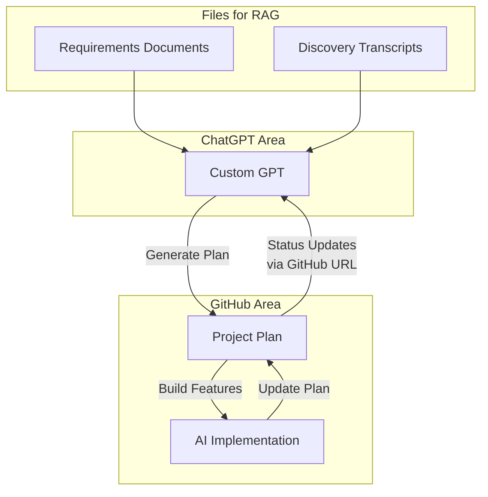

# Project Plan

## Introduction
This document outlines the project plan for developing the key features and modules of the application. The approach follows the **Doc Driven Development** methodology developed by **Ryan Vice** (https://docdrivendev.com/), which emphasizes using comprehensive documentation and AI tools to streamline development and maintain alignment throughout the project lifecycle.

### **Doc Driven Development Approach**
Our implementation of Doc Driven Development follows these key steps:

1. **Initial GPT Setup**
   - Created a custom GPT loaded with comprehensive requirements documentation
   - Included flow diagrams containing ERDs and discovery/review meeting transcripts
   - GPT serves as a knowledge base for project requirements and decisions

2. **Plan Generation**
   - Utilized the custom GPT to generate this executable markdown plan
   - Plan serves as a living document that guides implementation
   - Ensures alignment between requirements and execution

3. **AI-Driven Implementation**
   - AI Agents execute items from the plan
   - Maintain and update this plan document as implementation progresses
   - Ensures documentation stays in sync with development

4. **Documentation Integration**
   - Project overview document links back to this plan in GitHub
   - Public repository maintains transparency and accessibility
   - Enables seamless information flow between documentation and implementation

5. **Continuous Evolution**
   - Custom GPT maintains access to latest plan status via GitHub
   - Enables informed decisions for future requirements and planning
   - Creates a feedback loop between implementation and planning

This approach ensures that documentation drives development while maintaining adaptability and transparency throughout the project lifecycle.

---

## Feature Breakdown

### 1. Authentication
- [ ] Define authentication requirements (e.g., login, multi-factor authentication, password reset).
- [ ] Create user authentication flow diagrams.
- [ ] Develop API requirements for authentication endpoints.

### 2. User Management
- [ ] Define user roles and permissions.
- [ ] Draft requirements for user creation, updating, and deletion.
- [ ] Create ERD for user-related entities.

### 3. Billing
- [ ] Define invoicing requirements (e.g., accounts receivable, accounts payable).
- [ ] Map workflows for invoice generation and payment processing.
- [ ] Finalize integration requirements for payment gateways.

### 4. Reporting
- [ ] List key reports to be generated (e.g., Executive Summary).
- [ ] Define data sources and aggregation methods.
- [ ] Draft visualizations for report presentation.

### 5. Contact Management
- [ ] Outline requirements for managing contacts (e.g., carriers, factoring companies).
- [ ] Create workflows for adding, updating, and deleting contacts.
- [ ] Define database schema for contact management.

---

## Milestones
1. Complete authentication module (Est. Date: TBD)
2. Finalize user management workflows (Est. Date: TBD)
3. Deliver billing and invoicing module (Est. Date: TBD)
4. Generate first set of reports (Est. Date: TBD)
5. Finalize contact management feature (Est. Date: TBD)

---

## Progress Tracking
- [ ] Task 1: Define overall system architecture.
- [ ] Task 2: Review ERD for completeness.
- [ ] Task 3: Begin implementation of authentication module.

---

## Change Log
| Date       | Change                              | Author        |
|------------|-------------------------------------|---------------|
| YYYY-MM-DD | Initial draft created              | ChatGPT       |
| YYYY-MM-DD | Updated requirements for billing   | Ryan Vice     |

---

**Note**: This plan will evolve as new information is added and tasks are completed. Updates will be reflected in this document.

---
